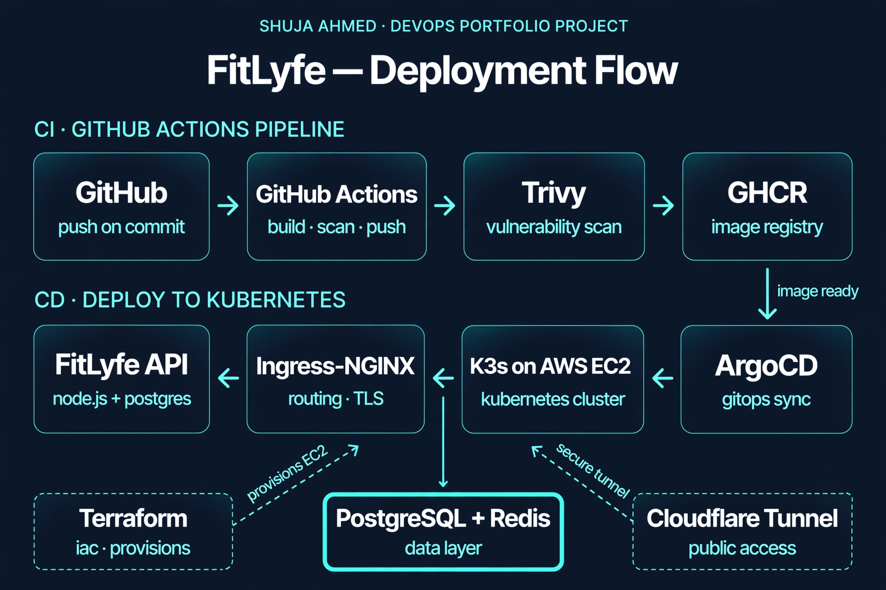
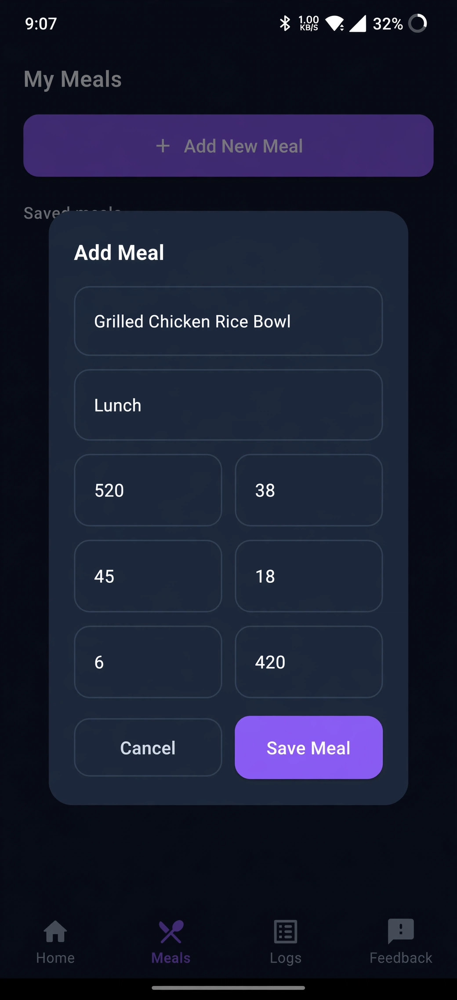
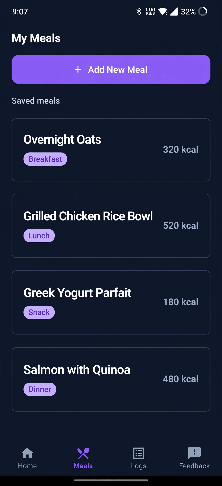
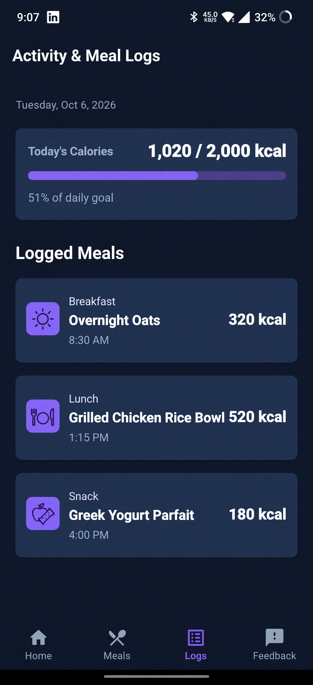
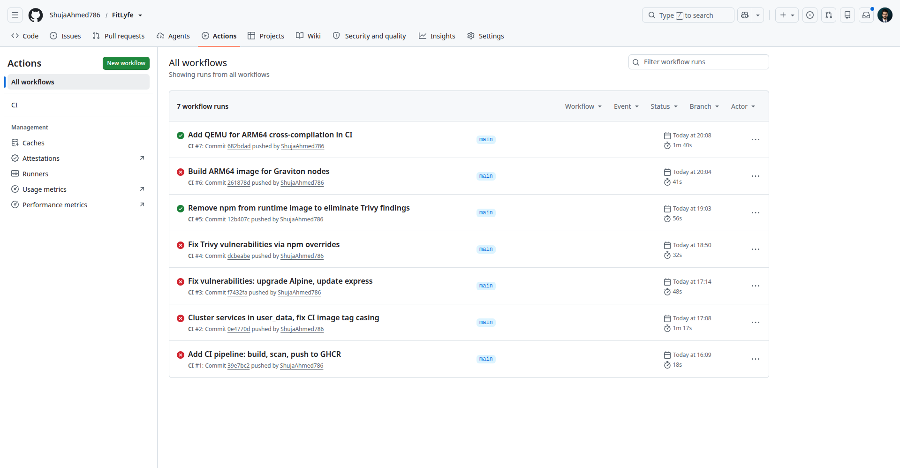
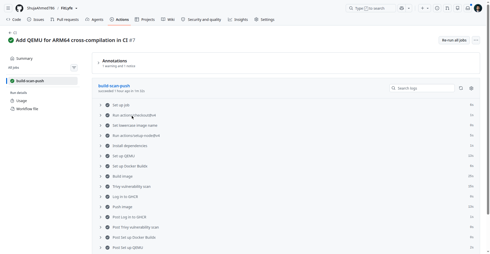
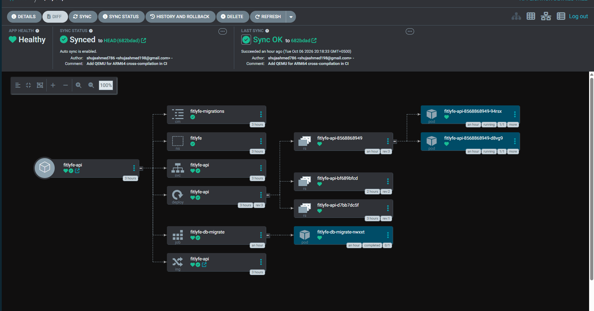

# Fit Lyfe | Smart Calorie & Nutrition Tracker 🥗📊

**Fit Lyfe** is a feature-rich, privacy-focused mobile application built with **Flutter** designed to make calorie tracking, meal planning, and health monitoring effortless, engaging, and lightning-fast. 

Whether your goal is to lose weight, build muscle, or maintain a balanced lifestyle, Fit Lyfe provides all the tools you need right on your device.

---

## Key Features

* **Calorie Tracker & Food Log:** Effortlessly log daily meals, snacks, and drinks with dynamic smart group emojis (automatically adapting for Breakfast, Lunch, Dinner, Protein, and Drinks) across your logs and screens.
* **Extensive Food Library:** Browse and search a robust database of food items powered by the USDA API to quickly find nutritional breakdowns and add your favorite meals.
* **Macro Counter:** Seamlessly monitor proteins, carbohydrates, and fats to stay precisely on target with your health and fitness goals.
* **Gamified Ranking System:** Stay motivated throughout your health journey by tracking your progress and leveling up through an engaging rank structure.
* **Daily Quick Tips:** Access bite-sized, actionable health, nutrition, and wellness tips right when you need them to build sustainable habits.
* **Persistent Undo & Local Backup:** Safeguard your data with local storage handling and a reliable 2-hour reset "undo" window that survives app restarts.
* **Built-in Feedback Mechanism:** Easily submit in-app feedback to help continuously improve the app experience.
* **Local Privacy First:** All personal health logs, custom meal lists, and user data remain stored securely right on your device.

---

## Tech Stack & Architecture

* **Framework:** Flutter & Dart
* **Data Management:** Local storage handling with robust state management and backup protocols
* **API Integration:** USDA API injected securely during builds via `--dart-define`
* **UI/UX:** Clean, distraction-free design with responsive layouts and dynamic visual indicators

---

## Getting Started (Development Setup)

To run this project locally, make sure you have the [Flutter SDK](https://docs.flutter.dev/get-started/install) installed.

1. **Clone the repository:**
       ```bash
     git clone [https://github.com/your-username/fit-lyfe.git](https://github.com/your-username/fit-lyfe.git)
     cd fit-lyfe
     Run the app (injecting your USDA API key):
     flutter run --dart-define=USDA_API_KEY=your_actual_api_key_here
   
3. Install dependencies:
     flutter pub get

4. Build & Release
     To generate an optimized Android App Bundle (.aab) for testing or deployment:
     flutter build appbundle --dart-define=USDA_API_KEY=your_actual_api_key_here

---

## DevOps Deployment

This project is deployed on AWS with a full CI/CD pipeline.

### Architecture



### App Screenshots

### Add Meal


### My Meals


### Activity Logs


### CI/CD Pipeline

GitHub Actions builds the Docker image, scans it with Trivy, and pushes to GHCR. ArgoCD syncs the manifests to the K3s cluster.





### ArgoCD GitOps

ArgoCD syncs the Kubernetes manifests from GitHub to the K3s cluster automatically on every push.



### Infrastructure

- **Cloud:** AWS (us-east-1)
- **Kubernetes:** K3s on EC2 (ARM64 Graviton)
- **Database:** PostgreSQL 14 + Redis
- **CI/CD:** GitHub Actions + ArgoCD GitOps
- **IaC:** Terraform
- **Access:** Cloudflare Tunnel

### Cost Breakdown

Monthly cost comparison (us-east-1, 730 hours/month):

| Cost Line Item | Right-Sized On-Demand |
|----------------|----------------------|
| K3s Cluster Compute | 2x t4g.small : $16.35 |
| DB / Cache Compute | 2x t4g.small : $16.35 |
| Egress NAT Compute | 1x t4g.nano (fck-nat) : $3.07 |
| Public IPv4 Allocation | 1x Elastic IP : $3.65 |
| EBS Disks (gp3) | 5x 15GB (75GB) : $6.00 |
| AWS S3 Backups | pgBackRest + Valkey : ~- **Access:** Cloudflare Tunnel.50 |
| Cloudflare Ingress | Zero-Trust Tunnel : - **Access:** Cloudflare Tunnel.00 |
| CI Runner Compute | GitHub Actions Free Tier : - **Access:** Cloudflare Tunnel.00 |
| **Total Monthly Spend** | **~$45.92 / mo** |

**Cost-saving decisions:**
- ARM64 Graviton (t4g) instances instead of x86
- fck-nat (self-managed) instead of AWS NAT Gateway
- K3s instead of EKS (no control plane fee)
- Self-hosted PostgreSQL/Redis instead of RDS
- Cloudflare Tunnel instead of AWS Load Balancer
